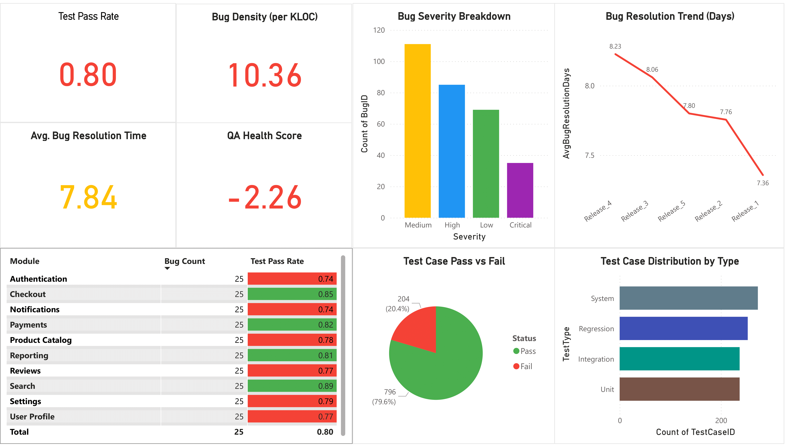

# 🧪 QA Metrics Dashboard

This project showcases a professional-quality **QA Metrics Dashboard** built using **Power BI and Microsoft Fabric**. It provides engineering and QA stakeholders with clear, actionable insights into software quality across multiple releases.

---

## 📊 Key Metrics Tracked

- ✅ Test Pass Rate
- 🐞 Bug Density (per KLOC)
- ⏱️ Average Bug Resolution Time
- 🌟 QA Health Score

---

## 📈 Visuals

- **KPI Cards** with conditional formatting
- **Bar Chart** for bug severity breakdown
- **Line Chart** showing bug resolution trends
- **Matrix** with module-wise bug counts and pass rates
- **Pie Chart** for test case outcomes
- **Bar Chart** showing test type distribution

---

## 📂 Dataset

All data is synthetic and included under `/data/`.

- `test_cases.csv`
- `bug_reports.csv`
- `releases.csv`
- `code_modules.csv`

---

## 🛠️ Tools Used

- Microsoft Fabric Lakehouse
- Power BI Web 
- DAX for KPI calculation
- Conditional formatting
- Scheduled refresh architecture

---

## 📄 Dashboard Summary

See [`qa-metrics-dashboard-summary.pdf`](qa-metrics-dashboard-summary.pdf) for a full export of the report layout and insights.

---

## 🤝 License

This project is open-source and free to use for learning and portfolio purposes.
